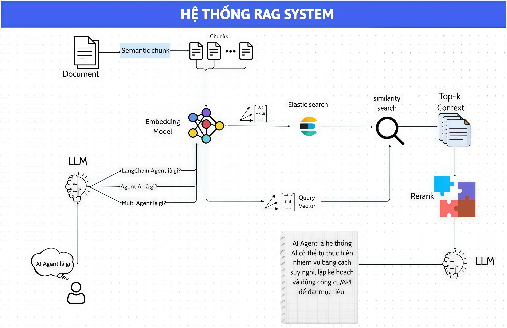

# RAG System

## Công nghệ sử dụng

| Thành phần | Công nghệ |
|-----------|-----------|
| Backend API | FastAPI |
| UI | Streamlit |
| Vector Database | Elasticsearch 8.x |
| Embedding / Rerank | Sentence Transformers |
| Query variants / Generation | Ollama |


# pineline 


# video demo
https://www.youtube.com/watch?v=KUflqZ_CRsY

## Yêu cầu

- Python 3.10
- Conda environment `RagSystem` hoặc virtual environment tương đương
- Elasticsearch 8.x
- Ollama đang chạy cục bộ nếu dùng truy vấn/generation
- Internet hoặc model cache sẵn cho lần tải đầu của Sentence Transformers

## Cài đặt môi trường

### Cách 1: Dùng `venv` (khuyến nghị, không cần Conda)

Windows PowerShell:

```powershell
python -m venv .venv
.venv\Scripts\Activate.ps1
pip install -r requirements.txt
```

macOS / Linux:

```bash
python3 -m venv .venv
source .venv/bin/activate
pip install -r requirements.txt
```

### Cách 2: Dùng Conda

```bash
conda create -n RagSystem python=3.10
conda activate RagSystem
pip install -r requirements.txt
```

Nếu bạn muốn dùng đúng bản GPU của PyTorch như môi trường hiện tại, cài riêng sau bước trên:

```bash
pip install torch torchvision torchaudio --index-url https://download.pytorch.org/whl/cu126

# máy mk phù hợp vs pytorch này 
pip install torch==2.11.0+cu126 torchvision==0.26.0+cu126 torchaudio==2.11.0+cu126 --index-url https://download.pytorch.org/whl/cu126
```

## Biến môi trường

```bash
ELASTICSEARCH_HOST=http://localhost:9200
ELASTICSEARCH_INDEX=vectors
UPLOAD_DIR=files
API_URL=http://localhost:8000
OLLAMA_HOST=http://127.0.0.1:11434
```

Nếu Elasticsearch của bạn bật security, cấu hình thêm:

```bash
ELASTICSEARCH_USERNAME=elastic
ELASTICSEARCH_PASSWORD=your_password
```

## Chạy thủ công

### 1. Chạy Elasticsearch

```bash
docker run -d --name elasticsearch -p 9200:9200 -p 9300:9300 -e "discovery.type=single-node" -e "xpack.security.enabled=false" docker.elastic.co/elasticsearch/elasticsearch:8.16.0
```

### 2. Chạy Ollama

Project hiện dùng:

- embedding query: `all-minilm:l6-v2`
- generation và query variants: `mistral:7b`

```bash
ollama pull all-minilm:l6-v2
ollama pull mistral:7b
ollama serve
```

### 3. Chạy backend

```bash
uvicorn main:app --reload
```

### 4. Chạy UI

```bash
streamlit run ui.py
```

## Docker Compose

`Docker/docker-compose.yml`.

```bash
docker compose -f Docker/docker-compose.yml up --build
```
